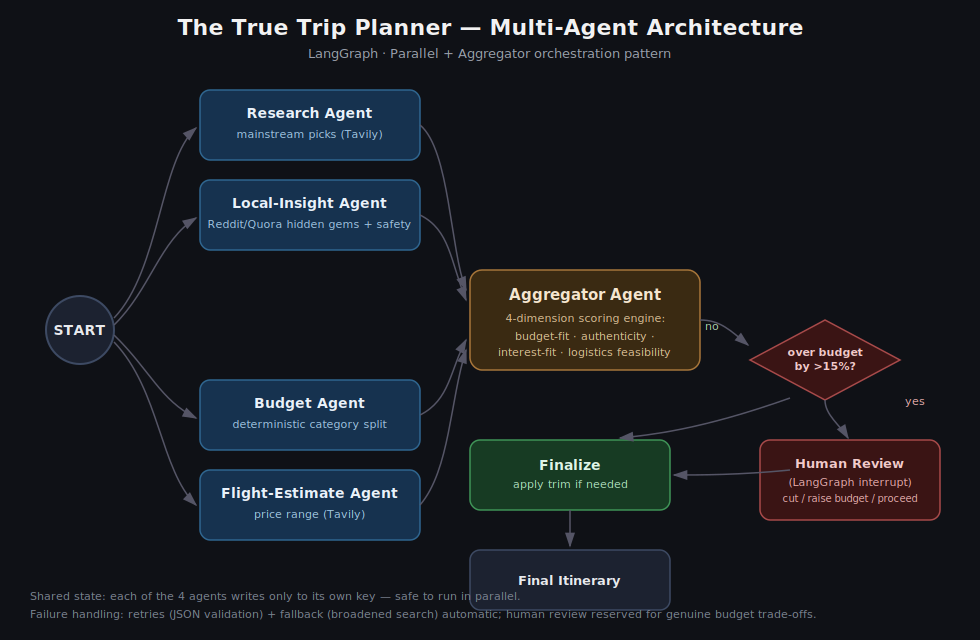

# The True Trip Planner

This is my capstone project for the Analytics Club's Agentic AI bootcamp (Learners'
Space 2026), a multi-agent travel itinerary planner built with LangGraph.

## Problem

I started this after planning a real family trip and noticing how little I could
trust the itineraries I found online. Travel agents and blog posts often have
commission tie-ups with the places they recommend, so they route you through the
same overcrowded spots and skip what locals actually think is worth seeing. There
was no quick way for me to check a mainstream recommendation against genuine local
opinion, or to know whether a plan I liked actually fit my budget and group size.

So I built something that cross-references mainstream travel sources against real
local insight from Reddit and Quora, scores every candidate activity across four
dimensions instead of trusting one source blindly, and only asks me to make a call
when a decision genuinely can't be automated, like a budget trade-off.

## Architecture



I coordinate five specialist agents through a Parallel + Aggregator orchestration
pattern:

| Agent | Responsibility |
|---|---|
| Research | Looks up mainstream, popular things to do at the destination using Tavily search |
| Local-Insight | Searches Reddit, Quora, and travel blogs for hidden gems, overrated spots, and safety notes. This is the part that actually differentiates it from a generic AI trip planner |
| Budget | Splits the budget deterministically across categories (stay, food, transport, activities), scaled to how many people are traveling |
| Flight-Estimate | Estimates a flight price range for the given dates and traveler count. Not a live booking integration, just a search-based estimate |
| Aggregator | Merges all four outputs into a day-by-day plan and scores every activity before finalizing it |

**State management.** All five agents read from one shared `TripPlanState` object,
but Research, Local-Insight, Budget, and Flight each only ever write to their own
key. I did that on purpose so they can run concurrently without any risk of
overwriting each other's work.

**Why Parallel + Aggregator.** Research, Local-Insight, Budget, and Flight are all
independent lookups. None of them needs another agent's output to do its job, so I
let them fan out concurrently and merge everything in one Aggregator node that also
resolves conflicts like a budget overrun. This is also why Local-Insight's fallback
(below) doesn't read Research's output when its own search comes up empty. Since the
two run in parallel, I can't guarantee Research has actually finished by the time
Local-Insight needs a fallback, so I had to make the fallback self-contained instead.

### The 4-dimension scoring engine

I score every candidate activity before finalizing the itinerary instead of just
accepting the LLM's first draft. Each dimension is a continuous value between 0 and
1, not a binary flag. Early on I had these as flags, and the overall scores kept
landing on the same two or three numbers, which looked hardcoded even though it
wasn't (more on that below).

| Dimension | What it measures |
|---|---|
| Budget-fit | How much of the remaining per-day activity budget this activity would use up |
| Authenticity | A 0-1 score the LLM itself estimates, grounded in the local-insight vs mainstream research context, not a hardcoded hidden-gem/mainstream flag |
| Interest-fit | Whether the activity matches the traveler's chosen interest tags (scenic, culture, shopping, nightlife) |
| Logistics feasibility | Combines time of day (late-night activities score lower, more so with kids in the group) with daily pacing, so an overpacked day gets marked less feasible |

`overall` is just the average of the four. Because three of the four inputs are
continuous and actually derived from the data, scores end up spread out naturally
instead of repeating.

### Failure handling

I built in four failure-handling mechanisms:

1. Retries. If an LLM call doesn't return valid JSON, I retry once with a stricter
   prompt before giving up (see `tools/llm.py::invoke_json`).
2. Fallback. If Local-Insight's niche Reddit/Quora query comes back empty, it
   broadens to a general destination query instead of just failing.
3. Human-in-the-loop. This is the only mechanism that pauses for a person, and it
   only fires once: if the drafted itinerary goes more than 15% over the activities
   budget, the graph pauses with a LangGraph `interrupt()` and asks whether to cut
   activities, raise the budget, or proceed anyway. If I pick cut activities, the
   lowest-scored ones get dropped one at a time until the plan fits, or every day is
   down to a single activity, whichever happens first.
4. Rate-limit backoff. Groq's free tier throttles on tokens per minute, so a 429
   gets retried after a short backoff instead of failing the whole run.

The first, second, and fourth are fully automatic, no human involved, because
there's an objectively correct way to recover. The third is deliberate and only used
once, because a budget trade-off doesn't have a single correct answer. That's a call
for the user to make, not the system.

## Tech stack

- **LangGraph** for multi-agent orchestration, shared state, and human-in-the-loop interrupts
- **Groq** (Llama 3.3 70B) for LLM inference
- **Tavily** for web search across the three search-based agents
- **Streamlit** for the dashboard UI
- **Python**

## Setup

```bash
python -m venv venv
venv\Scripts\activate          # Windows
pip install -r requirements.txt
```

Create a `.env` file (see `.env.example`) with:

```
GROQ_API_KEY=your_key_here
TAVILY_API_KEY=your_key_here
```

Run the dashboard:

```bash
streamlit run app.py
```

## Tests

I added tests for everything that doesn't need a live API call: the budget split,
the scoring formulas, the budget-trim algorithm, and the JSON-parsing fallback in
the LLM helper.

```bash
pip install -r requirements-dev.txt
pytest tests/ -v
```

## Validation

I wrote `validate.py` to run the full pipeline across 12 configurations, 4
destinations (Bali, Goa, Bangkok, Kyoto) crossed with 3 traveler types (solo, couple
with one kid, family of four), so I could actually confirm this generalizes instead
of just working for the one destination I happened to test with first:

```bash
python validate.py
```

## Known limitations and what it would take to fix them

I deliberately left these out of scope given the timeline. Each row is something I
expect could come up in review, so the third column is my honest answer for what
I'd actually need to do.

| Dropped | Why | What implementing it would take |
|---|---|---|
| Live flight booking | Real GDS/flight APIs (Amadeus, Skyscanner) need paid access and complex auth, out of scope for a one-week build | Integrate the Amadeus Self-Service API, add a booking-confirmation step, and extend the state schema with a `flight_booking` slot |
| Credit-card/cashback offer matching | No reliable free data source for card-specific offers | Would need a partnership-style data feed (something like CardPointers) or manual curation per issuer, not something a search API can answer |
| Cross-platform price comparison | Different product from itinerary planning, would need its own scraping/comparison infrastructure | A separate agent that queries multiple booking sites for the same stay/activity and normalizes prices for comparison |
| Live deployment | Not required for grading, optional polish | Deploy via Streamlit Community Cloud (free), pointing at this repo with `GROQ_API_KEY`/`TAVILY_API_KEY` set as secrets |

## Issues found and fixed during development

- Streamlit was rendering dollar amounts as LaTeX. Its markdown renderer treats
  `$...$` as an inline math formula, so any text with two or more dollar signs in it
  (a budget-overrun message, a flight price summary) came out as broken italic math.
  I fixed it by escaping literal `$` before passing any LLM-generated text into
  `st.write`, `st.caption`, `st.warning`, or `st.info`.
- Scoring looked hardcoded. My original authenticity and logistics-feasibility
  scores were binary flags, so `overall` kept landing on the same two or three
  numbers no matter which activity I looked at. I replaced both with continuous,
  data-driven formulas so scores actually vary per activity now.
- Budget trimming didn't actually respect the budget. The cut-activities path used
  to drop a fixed ~20% of activities no matter how far over budget the plan was, so
  a big overrun could still leave the trimmed plan way over budget. I fixed it to
  drop the lowest-scored activities one at a time until the plan actually fits, or
  every day is down to one activity.
